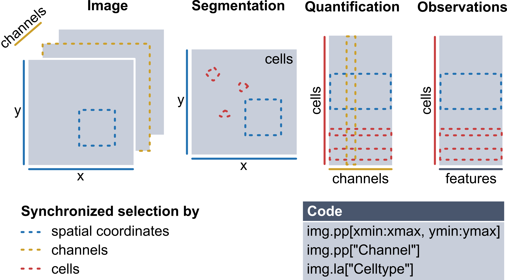

# spatialproteomics

[](https://badge.fury.io/py/spatialproteomics)

`Spatialproteomics` is an interoperable toolbox for analyzing highly multiplexed fluorescence image data. This analysis involves a sequence of steps, including segmentation, image processing, marker quantification, cell type classification, and neighborhood analysis. 

<p align="center" width="100%">
    
</p>

## Principles

Multiplexed imaging data comprises at least 3 dimensions (i.e. `channels`, `x`, and `y`) and has often additional data such as segmentation masks or cell type annotations associated with it. In `spatialproteomics`, we use `xarray` to create a data structure that keeps all of these data dimension in sync. This data structure can then be used to apply all sorts of operations to the data. Users can segment cells, perform different image processing steps, quantify protein expression, predict cell types, and plot their data in various ways. By providing researchers with those tools, `spatialproteomics` can be used to quickly explore highly multiplexed spatial proteomics data directly within jupyter notebooks.

<p align="center" width="100%">
    
</p>

## Getting Started

Please refer to the [documentation](https://sagar87.github.io/spatialproteomics) for details on the API and tutorials.

## Installation

To install `spatialproteomics`, first create a python environment and install the package using 

```
pip install spatialproteomics
```

The installation of the package should take less than a minute.

## System Requirements
### Hardware Requirements
`spatialproteomics` requires only a standard computer with enough RAM to support the in-memory operations. Certain steps of the pipeline, such as segmentation, benefit from using a GPU.

### Software Requirements
The base version of `spatialproteomics` depends on the following packages:
```
xarray
zarr
numpy
scikit-image
scikit-learn
opencv-python
matplotlib
```

## Citation
Spatialproteomics - an interoperable toolbox for analyzing highly multiplexed fluorescence image data

Matthias Fabian Meyer-Bender, Harald Sager Voehringer, Christina Schniederjohann, Sarah Patricia Koziel, Erin Kim Chung, Ekaterina Popova, Alexander Brobeil, Lisa-Maria Held, Aamir Munir, Scverse Community, Sascha Dietrich, Peter-Martin Bruch, Wolfgang Huber

bioRxiv 2025.04.29.651202; doi: https://doi.org/10.1101/2025.04.29.651202
