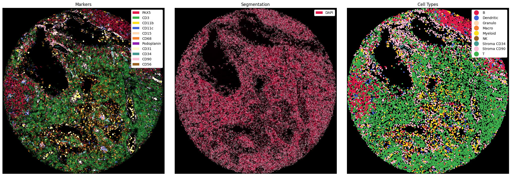

# spatialproteomics

[](https://badge.fury.io/py/spatialproteomics)

`spatialproteomics` is a light weight wrapper around `xarray` with the intention to facilitate the processing, exploration and analysis of highly multiplexed immunohistochemistry data.

<p align="center" width="100%">
    
</p>

## Principles

Multiplexed imaging data comprises at least 3 dimensions (i.e. `channels`, `x`, and `y`) and has often additional data such as segmentation masks or cell type annotations associated with it. In `spatialproteomics`, we use `xarray` to create a data structure that keeps all of these data dimension in sync. This data structure can then be used to apply all sorts of operations to the data. Users can segment cells, perform different image processing steps, quantify protein expression, predict cell types, and plot their data in various ways. By providing researchers with those tools, `spatialproteomics` can be used to quickly explore highly multiplexed spatial proteomics data directly within jupyter notebooks.


## Installation

To install `spatialproteomics` first create a python environment and install the package using 

```
pip install spatialproteomics
```

## Documentation

Check the documentation for further information https://sagar87.github.io/spatialproteomics/.

For a more interactive learning experience, you can also check out [this workshop](https://github.com/MeyerBender/spatialproteomics_workshop).
