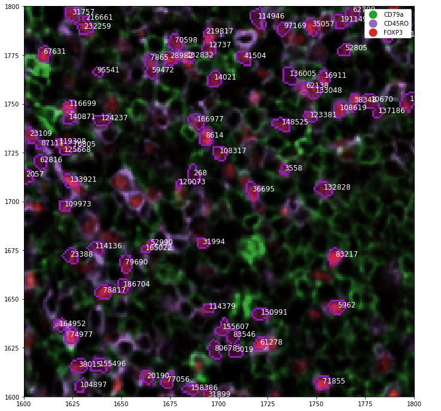

# Spatial-data

[](https://badge.fury.io/py/spat-data)

Spatial data is a light weight wrapper around `xarray` with the intention to facilitate the data exploration and analysis of highly multiplexed immunohistochemistry data.

<p align="center" width="100%">
    
</p>

## Principles

Multiplexed imaging data comprises at least 3 dimensions (i.e. `channels`, `x`, and `y`) and has often additional data associated such as a segmentation and cell type annotatons which implictly introduce new dimensions such as `cells` and `labels`. In `spatial-data`, we use `xarray` to create a data structure that keeps all of these data dimension in sync. This enables us to subset the data efficiently and perform reproducible exploratory data analyses in Juyter Notebooks as `spatial-data` comes with exteneded plotting functions.


## Installation

To install `spatial-data` first create `Python 3.8` environment and install the package using 

```
pip install spat-data
```

and check the documentation for further information https://sagar87.github.io/spatial-data/.


## History


## 0.2.2

* Updated data import tutorial.
* Updated RTD theme to make it wider.
* Added slicing tutorial.
* Added plotting tutorial.
* Implemented neighborhood graph calculation.
* Implemented `draw_edges` function.
* Added data extraction tutorial.

## 0.2.1

* `.im` selector accepts arguments in form of `[channel, xmin:xmax]`
* `.im` selector does not break when `Dims.CELLS` is not present


